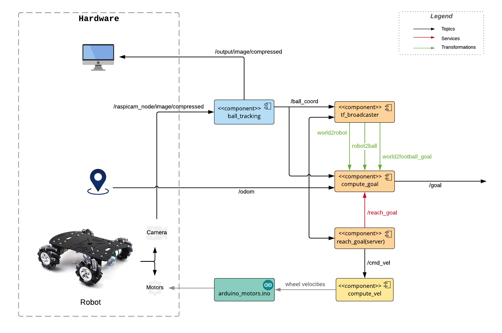

# Football Game
## Experimental Robotics Laboratory - Lab. 2

The goal of this second lab is to implement an algorithm to make a robot able to detect a ball and kick it inside the football goal.
The ball is of a given color so that it can be recognized through a previously calibrated monocular camera, mounted on the robot. 
The files for the camera calibration have been added in the apposite folders of the Raspberry, so that they are automatically retrieved when the camera node is launched. The calibration has been performed for two resolutions: 640x480 and 320x200.

The dimensions of the football field are given, thus the position of the football goal is known.
The position of the robot wrt the world is always available thanks to markers placed in the environment.
These informations allow to compute the robot's desired position and orientation to properly being able to 
score a gol.
The robot used is omnidirectional.

## Software Architecture
<p align="center"> 

</p>

## How to run the code
### Simulation
The behaviour of the robot can be simulated by launching the simulation on Gazebo:
```
roslaunch football_game gazebo.launch <arguments>
```
where arguments should be the coordinates x and y of the starting intial position of the robot;
  
For example, a possible command is:
```
roslaunch football_game gazebo.launch r_x:=0 r_y:=0
```
In order to publish the position of the ball, open a new terminal and type:
```
rostopic pub -r 1 /ball_coord geometry_msgs/Point '5.0' '0.0' '6.0'
```
Once Gazebo is open, press play to start the simulation: the robot will reach a goal position and orientation
which allows it to kick the ball inside the football goal.

### Map the velocities on the real robot
To perform the task with the real robot, open a terminal and connect via ssh to the Raspberry.

In a terminal on your computer, launch roscore by typing:
```
roscore &
```
In the same terminal, publish the velocities of the robot:
```
rostopic pub -r 1 /cmd_vel geometry_msgs/Twist -- '[1.0, 0.0, 0.0]' '[0.0, 0.0, 0.0]'
```
On the Rasberry, go inside the project folder and run the compute_vel script:
```
python compute_vel.py
```
This script will compute the velocities that should be given to the wheels, on the basis of the linear and angular velocities published on the /cmd_vel topic.


### Perform ball tracking
In order to perform the ball tracking and publish the position of the ball wrt the robot on the topic /ball_coord, launch the raspicam node on the Raspberry by typing:
```
roslaunch raspicam_node camerav2_320x200_30fps.launch enable_raw:=true
```
Eventually, in another terminal, go inside the project folder and run:
```
python ball_tracking.py
```

## Doxygen documentation 
To compile the code documentation, it is required to run the following command in the workspace:
```
doxygen Lab2_documentation
``` 
Enter the newly generated folder */doxygen_documentation/html* and open *index.html*.

## Authors
| Name | E-mail | ID |
|------|--------|--------|
| Luna Gava| lunagava@me.com | 4206721 |
| Lucrezia Grassi | lucre.grassi@gmail.com | 4223595 |
| Marta Lagomarsino | marta.lago@hotmail.it | 4213518 |
